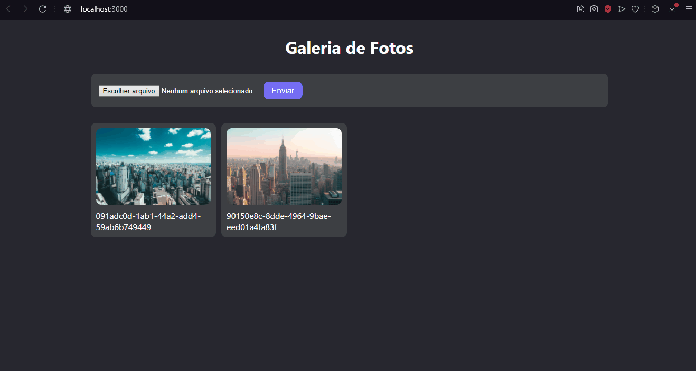

<h1>Galeria</h1>

<h2>Sobre</h2>

<p>Aplicativo feito para ser uma galeria. Você pode adicionar fotos e elas aparecerão na tela!</br>
Backend feito com Firebase
</p>

### Features
- [x] Inserir novas Fotos

<h1>
    
</h1>

### Pré-requisitos
Antes de começar, você vai precisar das seguintes ferramentas: [Git](https://git-scm.com), [Node.js](https://nodejs.org/en/) e um editor de código, como o [VSCode](https://code.visualstudio.com/)

### Rodando o projeto
```bash
# Clone este repositório
git clone https://github.com/MalcolmMello/photoGalery

# Acesse a pasta do projeto pelo seu terminal
cd photoGalery

# Instale as dependências
npm install

# Inicie a aplicação
npm start

# O servidor irá rodar na porta:3000 - acesse <http://localhost:3000>

```

### Tecnologias
- React
- Typescript
- Styled-components
- Firebase

---

Feito no desafio 5 projetos em 5 dias pela B7Web - [Meu LinkedIn](https://www.linkedin.com/in/malcolm-de-mello-a8208a224/)
